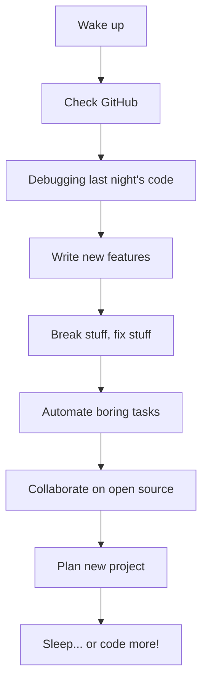
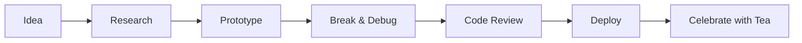

<!-- HEADER BANNER -->
<p align="center">
  
</p>

<!-- SOCIAL & CONTACT -->
<p align="center">
  <a href="mailto:frfvipbl@gmail.com"></a>
  <a href="#"></a>
  <a href="Aafghan.com"></a>
  <a href="https://github.com/bilalfrf"></a>
</p>

<br/>

<!-- PROFILE GIF -->
<p align="center">
  
</p>

---

# 👤 About Me

```yaml
name: Bilal Fazil
status: Full-Stack Developer | Backend Enthusiast | Angry Debugger 😤
location: 🌍 Earth
skills: [PHP, Python, JavaScript, HTML, CSS, SQL, MongoDB, MySQL, Laravel, Flask, React, Bootstrap, Blade, Git, Linux, Docker]
languages: [English, Turkish]
pronouns: [he, him]
```

---

# 🖥️ My Tech Toolbox

### Programming Languages

<p>
  
  
  
  
  
  
</p>

### Frameworks & Libraries

<p>
  
  
  
  
  
  
</p>

### Databases & Dev Tools

<p>
  
  
  
  
  
  
  
</p>

### Cloud & Deployment

<p>
  
  
  
  
</p>

---

# 🌟 Featured Projects

## [tailor](https://github.com/bilalfrf/tailor) &nbsp; 
**A customizable tool for tailored solutions, built with PHP and Blade.**

- Modular, scalable backend
- Elegant Blade templates
- MySQL powered data

---

## [laravel_react_api](https://github.com/bilalfrf/laravel_react_api) &nbsp; 
**A robust API backend for React, with JWT authentication, RBAC, and more.**

- Secure user authentication & CRUD
- Role-based permissions
- Dynamic filtering & pagination

---

## [social_media](https://github.com/bilalfrf/social_media) &nbsp; 
**A full-featured social media platform built on Flask and MongoDB.**

- Stories, photos, videos
- Like/Dislike, comments, follows
- Bootstrap frontend

---

## [organizasion_and_team_app](https://github.com/bilalfrf/organizasion_and_team_app) &nbsp; 
**Team management simplified with PHP and Blade.**

- Create/manage teams
- Assign roles and permissions

---

## [school](https://github.com/bilalfrf/school) &nbsp; 
**Manage educational processes with Python and HTML.**

---

## [biyar](https://github.com/bilalfrf/biyar) &nbsp; 

---

<details>
  <summary>More Projects & Contributions (click to expand)</summary>

- [untitled](https://github.com/bilalfrf/untitled): Social media platform experiment (PHP version)
- [YaserFazil/PkgScan](https://github.com/YaserFazil/PkgScan): Open source package scanner (Python)
- [YaserFazil/AmerikadaYasiyorum](https://github.com/YaserFazil/AmerikadaYasiyorum): Affiliate & coupon site (HTML, JS, Python)
- [AmarFazal/PkgScan](https://github.com/AmarFazal/PkgScan): Python scanner, variant

</details>

---

# 📈 GitHub Stats

<p align="center">
  
  
</p>
<p align="center">
  
</p>

---

# 🏆 GitHub Trophy Case

<p align="center">
  
</p>

---

# 🤖 My Coding Journey

- Started with HTML pages, now building complex, scalable full-stack systems 🚀
- API addict: if it can be automated or exposed, I’ll do it!
- Always learning: new languages, frameworks, best practices
- Community-focused: open source contributor and collaborator

---

# 🎨 Design & Animation

<p align="center">
  
</p>

---

# 🎯 2025 Goals

- 🚀 Launch an open-source SaaS
- 💻 Contribute to 10+ major open source projects
- 📚 Start a tech blog and YouTube channel
- 🐳 Master Docker/Kubernetes for scalable deployments

---

# ⚡ Fun Facts & Hobbies

- Favorite debugging fuel: tea and determination ☕🔥
- Sometimes angry coding = focused coding!
- Automate all the things!
- Outside of code: gaming, tech trends, and chasing new ideas

---

# 🌱 Currently Learning

- Advanced React
- Docker & DevOps
- Cloud architectures

---

# 📚 Blog & Tutorials

_Coming soon!_  
Tutorials, deep dives, and dev stories—stay tuned!

---

# 🏁 Thanks for Stopping By!

<p align="center">
  
</p>

---

# 🧩 More About Me

<details>
  <summary>Click to expand!</summary>

## 🔥 Coding Philosophy

- If you’re not breaking things, you’re not pushing hard enough.
- Embrace every bug—they teach more than the docs ever could.
- Angry coding = productive coding.

## 🗂️ Project Organization

- Modular code, clear docs
- Automated testing & CI/CD
- Always leave room for improvement

## 👨‍💻 Ideal Stack

- **Frontend:** React, Bootstrap, HTML/CSS
- **Backend:** Laravel, Flask, PHP, Python
- **Database:** MongoDB, MySQL
- **Tools:** Docker, Git, VS Code

## 🌍 Languages

- English, Turkish

## 🧑‍🏫 Mentoring

- Happy to help new devs—need advice or code review? Just ask!

## 🎲 Random Quote

> "Stay hungry. Stay foolish. Stay coding—even when the bugs bite back."

</details>

---

# 👀 Visitor Counter

<p align="left">
  
</p>

---

# 📫 Contact

<p align="center">
  <a href="mailto:your.email@example.com"></a>
  <a href="#"></a>
  <a href="#"></a>
  <a href="https://github.com/bilalfrf"></a>
</p>

---

<!-- GITHUB ACTIVITY GRAPH -->
# 📊 Activity Graph

<p align="center">
  
</p>

---

<!-- DYNAMIC BADGES -->
# 🏅 Dynamic Badges

<p align="center">
  
  
  
  
</p>

---

# 👨‍💻 My Typical Day



---

# 🚦 My Workflow



---

# ❤️ Thank You!

Thanks for stopping by my profile!  
If you like my work, leave a ⭐ on my repos or connect with me.  
Happy coding! 🚀

---

<!-- END OF README -->
